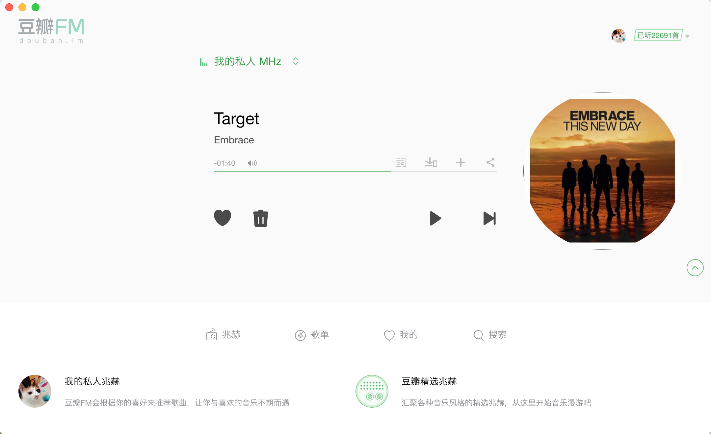

# FM 

这是一个基于 [electron](https://github.com/electron/electron) 开发的桌面端[豆瓣FM](https://douban.fm).

## WHY

豆瓣FM是个非常棒的应用，但是官方没有提供桌面端，虽然使用浏览器听歌也很好，但是在某些情况下胡很麻烦。比如要想切歌场景，就需要先切换到浏览器，再找到豆瓣FM来进行切歌，操作不够方便。桌面端很好的解决了这些问题。

 

	

## 功能

### Keyboard shortcuts

- 喜欢/不喜欢: <kbd>Command</kbd> <kbd>7</kbd>
- 播放/暂停: <kbd>Command</kbd> <kbd>8</kbd>
- 上一首: <kbd>Command</kbd> <kbd>9</kbd>
- 下一首: <kbd>Command</kbd> <kbd>0</kbd>

### 返回
添加了返回按钮（模拟浏览器返回）

## 下载

[**Download**](https://github.com/jjvvv/doubanfm/releases/latest)

## 感谢

- [豆瓣FM](https://douban.fm)
- [Electron quick start](https://github.com/electron/electron-quick-start)

## TODO

* 支持上一首按钮
* 支持单曲循环

## License

MIT
